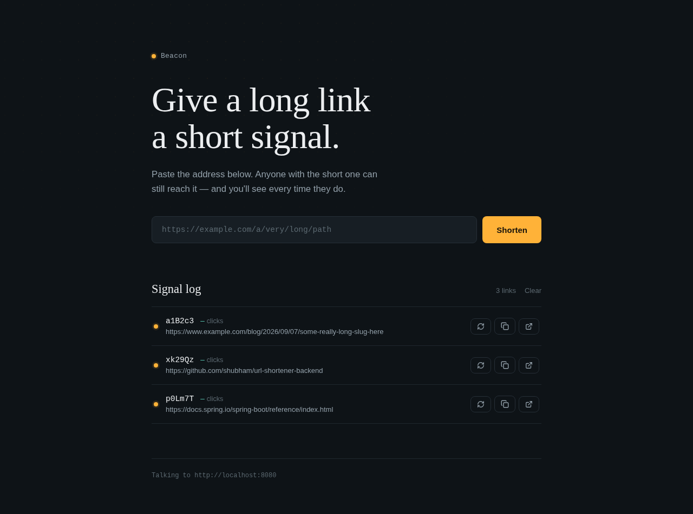
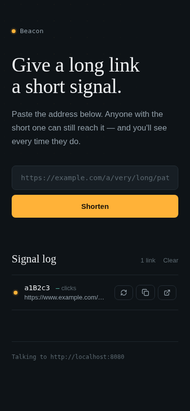
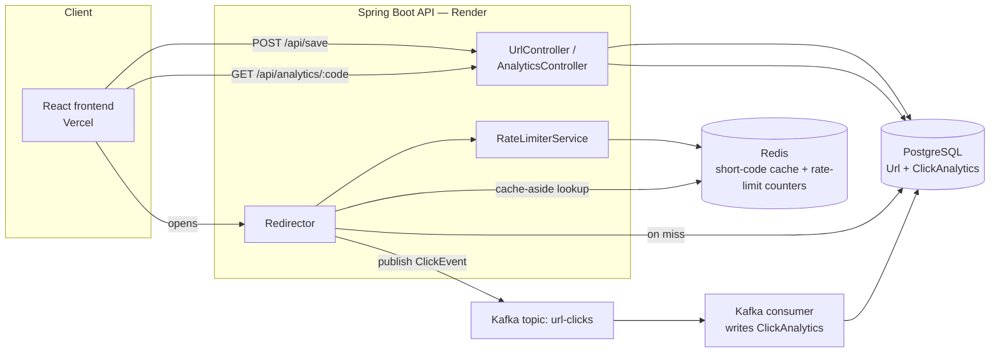

<div align="center">

# Beacon

### A URL shortener built to demonstrate real backend engineering — not just a CRUD wrapper.

[](#)
[](#)
[](#)
[](#)
[](#)
[](#)
[](#)
[](#)

 [API reference](#api-reference) · [Architecture](#architecture)

</div>

---

## Why this project exists

Anyone can build a table that maps a short string to a long URL. This project
is deliberately over-built relative to that minimum, on purpose: it's a
sandbox for the pieces of backend engineering that show up in real systems
under load — a cache-aside pattern on the hot read path, an async event
pipeline decoupled from the request/response cycle via Kafka, and
IP-based rate limiting — wired together in a way that's small enough to
read end-to-end in one sitting.

<div align="center">
  
</div>

<details>
<summary>Mobile view</summary>
<div align="center">
  
</div>
</details>

---

## Features

- **Shorten any URL** into a 6-character code (`POST /api/save`)
- **Redirect** through the short code, with click tracking (`GET /redirect/{code}`)
- **Per-visitor rate limiting** on redirects, backed by Redis (`GET /api/analytics/{code}`)
- **Click analytics** — every redirect fires an async event that's counted independently of the redirect path, so tracking never slows down the user
- A frontend that treats the short link as a "beacon" — a signal you send out and watch get followed, with a live per-link click log

---

## Architecture



**The redirect path is intentionally the fastest path in the system.**
Looking up the destination URL hits Redis first (`@Cacheable`) and only
falls through to Postgres on a cache miss. Recording *that* the click
happened is pushed onto Kafka and handled by a separate consumer — so a
burst of traffic on a popular link never makes the redirect itself slower,
and a slow analytics write never blocks a user waiting to be redirected.

---

## Engineering decisions

The table below is the "why," for anyone reading the code and wondering
why a link shortener has a message broker in it.

| Decision | Why |
|---|---|
| **Redis cache-aside on `getActualUrl`** (`@Cacheable`) | The redirect endpoint is, by definition, the highest-traffic path in a URL shortener — every click hits it, and popular links get hit repeatedly. Caching the short-code → URL lookup keeps that path off Postgres almost entirely. |
| **Kafka between the redirect and the analytics write** | Redirecting the user and recording that it happened are two different jobs with two different latency budgets. Publishing a `ClickEvent` and returning the `RedirectView` immediately means a slow or backed-up analytics write can never add latency to the thing the user is actually waiting on. |
| **Redis-backed rate limiter, not in-memory** | An in-memory counter only works on a single instance. Backing it with Redis (atomic `INCR` + `EXPIRE`) means the limit holds even if the API is later scaled to multiple instances — it doesn't need rewriting to survive a scale-out. |
| **DTOs (`SaveDto`, `SaveResponseDto`, `AnalyticsResponse`) instead of returning entities directly** | Keeps the JPA entities (and their persistence-layer concerns — IDs, lazy associations) out of the public API contract. The wire format can evolve independently of the schema. |
| **`SecureRandom`-generated 6-character codes with a collision check on save** | Sequential IDs (`/1`, `/2`, `/3`...) leak how many links exist and make every link guessable by incrementing a number. Random codes with an explicit `existsByShortCode` retry loop trade a small, bounded amount of write-time work for links that aren't trivially enumerable. |
| **Config externalized to environment variables, with local defaults preserved** | Every datasource/cache/broker value falls back to the original local setting if no env var is set. Local development with Docker Compose never changed, but the exact same artifact deploys to managed Postgres/Redis/Kafka in production with zero code changes — just configuration. |
| **Backend and frontend deployed and versioned independently** (Render / Vercel) | The API has no opinion about how it's consumed — CORS is the only coupling. This is what makes it realistic to imagine a mobile client or a second frontend consuming the same API later. |
| **No auth layer, on purpose** | Scope control. Auth is a well-understood, separate problem — bolting on a half-finished login system would have diluted the point of this project, which is the redirect/cache/queue pipeline. The frontend keeps a client-side link log (`localStorage`) instead, which is an honest reflection of "no accounts" rather than a workaround for a missing feature. |

---

## Tech stack

**Backend** — Java 26 · Spring Boot 4.1 (Web MVC, Data JPA, Data Redis, Cache, Kafka, Validation) · PostgreSQL · Redis · Apache Kafka · springdoc-openapi

**Frontend** — React 19 · Vite · vanilla CSS (no UI kit) · lucide-react

**Infrastructure** — Docker & Docker Compose (local) · Render (API + Postgres + Redis) · Confluent Cloud (managed Kafka) · Vercel (frontend)

---

## API reference

| Method | Endpoint | Description |
|---|---|---|
| `POST` | `/api/save` | Shortens a URL. Body: `{ "url": "https://..." }` → `{ "actualUrl", "shortCode" }` |
| `GET` | `/redirect/{shortCode}` | Redirects to the original URL and records a click event. Rate-limited to 2 requests/minute per IP. |
| `GET` | `/api/analytics/{shortCode}` | Returns `{ "shortCode", "totalClicks" }` |

Interactive OpenAPI docs are available at `/swagger-ui.html` when the backend is running.

---

## Project structure

```
url-shortener/
├── backend/                  # Spring Boot API
│   ├── src/main/java/com/shubham/url_shortner/
│   │   ├── controllers/      # UrlController, AnalyticsController, Redirector
│   │   ├── services/         # UrlService, AnalyticsService, RateLimiterService
│   │   ├── kafka/            # Producer + Consumer for ClickEvent
│   │   ├── repositories/     # Spring Data JPA repos
│   │   ├── entity/           # Url, ClickAnalytics
│   │   ├── dtos/             # Request/response contracts
│   │   └── config/           # WebConfig (CORS), KafkaConfig
│   └── Dockerfile
├── frontend/                 # React + Vite
│   └── src/
│       ├── components/       # ShortenForm, ResultCard, SignalLog, LogRow
│       ├── api.js            # Thin fetch client over the 3 endpoints
│       └── useLinkLog.js     # localStorage-backed client-side link history
└── docker-compose.yml        # Kafka + Redis for local dev
```

---

## Running it locally

```bash
# 1. Infra
docker-compose up -d          # Kafka + Redis
# create a local Postgres database named `url-shortner`

# 2. Backend
cd backend
./mvnw spring-boot:run        # http://localhost:8080

# 3. Frontend
cd frontend
cp .env.example .env
npm install && npm run dev    # http://localhost:5173
```

No environment variables are required for local dev — every config value
falls back to the local defaults in `application.properties`.


## What I'd add next

Being upfront about scope also means being upfront about what's out of it:

- **Auth + per-user link ownership** — right now every link is anonymous by design; accounts would be the natural next layer.
- **Custom short codes** — letting a user request a specific alias instead of a random one.
- **Click analytics breakdown** — the schema already captures `userAgent`, `referrer`, and `timestamp` per click; only the aggregate count is exposed today. A time-series/breakdown endpoint is a small step from here.
- **`X-Forwarded-For`-aware rate limiting** — the current limiter reads the direct client IP, which is correct locally but sees Render's proxy IP in production. Documented as a known limitation in `DEPLOYMENT.md`.

---


